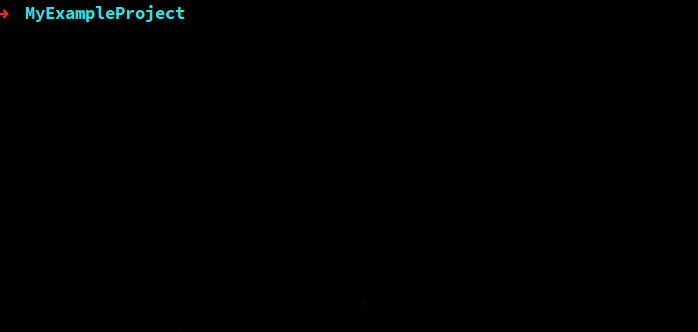
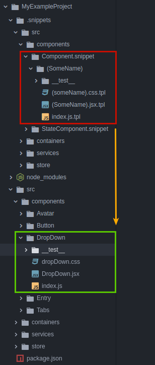

# Project Snippets

Keep code snippets directly in your project repository and let anyone create files easily and quickly.



## Quick start and how it works

### Installation

First, install the package:

```bash
yarn add --dev project-snippets

# or npm

npm install --save-dev project-snippets
```

Now you have available `snippet` command, let's use this in `package.json` as `create` script:

```json
{
    "scripts": {
        "create": "snippet create"
    }
}
```

You can run this by typing `yarn run create` or `npm run create`, but first you need `.snippets` directory with your code templates.

### Snippets directory



For example you like to make a snippet for components in `/src/components/*.js`, then `.snippets` directory structure should look like this:

```
.snippets/
    src/
        components/
            MySimpleComponent.snippet/    ← Snippet name, this dir will be omitted
                (SomeName).js.tpl         ← Snippet files or even directories
                (someName).css.tpl        ← .tpl extension is important!
```

Now after running the `create` command, you will see list for your snippets. If you select `MySimpleComponent` and then enter the name eg. `circle button` it will create a file:

```
src/
    components/
        …
        CircleButton.js
        circleButton.css
        …
```

Let's look inside the files.

### Templates

Inside the files will we use [ejs templates](https://github.com/mde/ejs):

`(SomeName).js.tpl`:

```js
import '<%= someName %>.css'

export function <%= SomeName %>() {
    // ...
}
```

And similarly for `(someName).css.tpl`.
```
.<%= someName %> {
    /* ... */
}
```

Finally, that's all, now you can run this command again and you will receive ready to use `CircleButton.js` and  `circleButton.css` files:

```javascript
import 'circleButton.css'

export function CircleButton() {
    // ...
}
```
```css
.circleButton {
    /* ... */
}
```

### CLI options

* `--dry-run` - show the contents of files without creating them

### Variables

The following variables are now available:

* Camel case: `someName`
* Pascal case: `SomeName`
* Snake case: `some_name`
* Constant case: `SOME_NAME`
* Param case: `some-name` (IMPORTANT: inside templates use <%= locals['some-name'] %>)

#### Custom variables

If you need more options for your snippet you can create the `options.json` file in snippet directory. (And remember: empty file = no file)

Example `.snippets/src/components/Component.snippet/options.json`:
```json
[
    {
        "type": "confirm",
        "name": "styles",
        "message": "With styles?"
    },
    {
        "type": "confirm",
        "name": "tests",
        "message": "With unit tests?"
    }
]
```


### Roadmap

* [x] Simple snippet generator
* [x] `--dry-run` option
* [x] Custom variables in snippets
* [ ] Handlebars templates support
* [ ] `init` command to example `.snippet` and script in `package.json`
* [ ] Plugins:
    * [ ] Atom
    * [ ] Visual Studio Code
    * [ ] Sublime Text
    * [ ] WebStorm
* [ ] `generate` command to create snippets from shared resources
